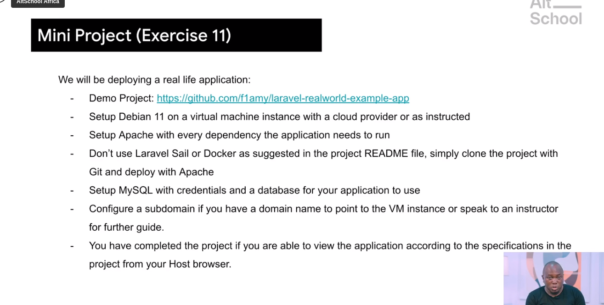

# Task

+ To deploy a laravel on a cloud instance 
+ using the git repo https://github.com/f1amy/laravel-realworld-example-app.git
+ To connect public ip to created DNS
+ To submit details to project.

### Submission
 * My created Domain = http://spersislaravel.me
* My cloud instance = AWS cloud services
* My cloud public ip = 3.92.208.81
